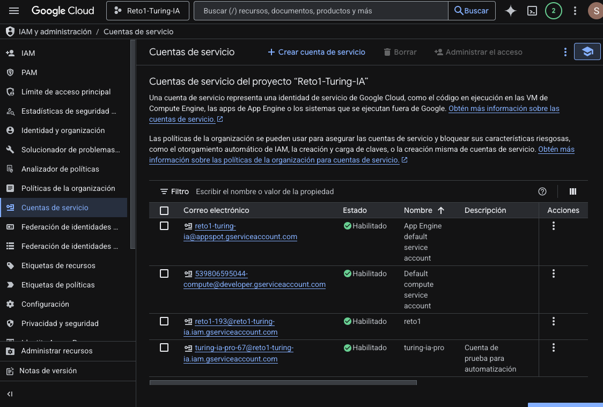
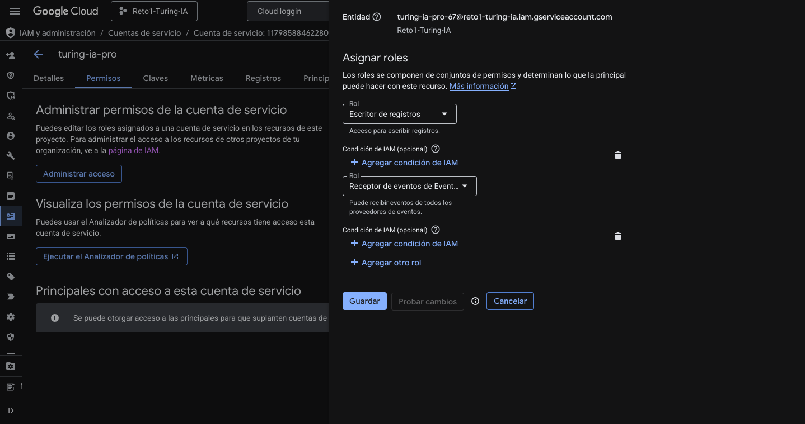
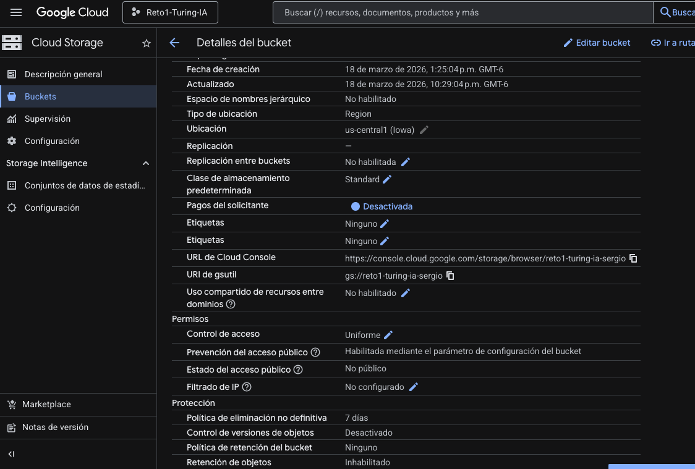
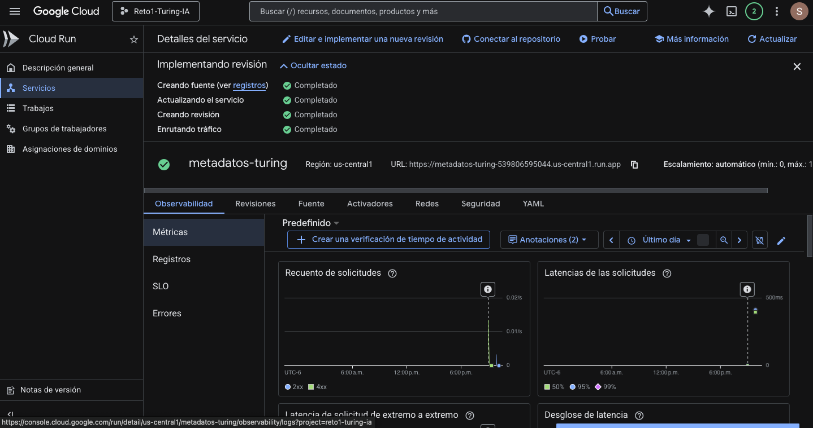
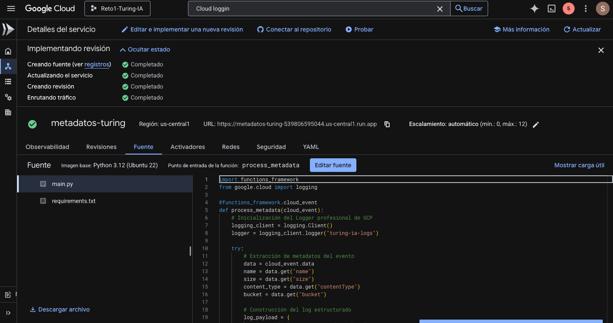
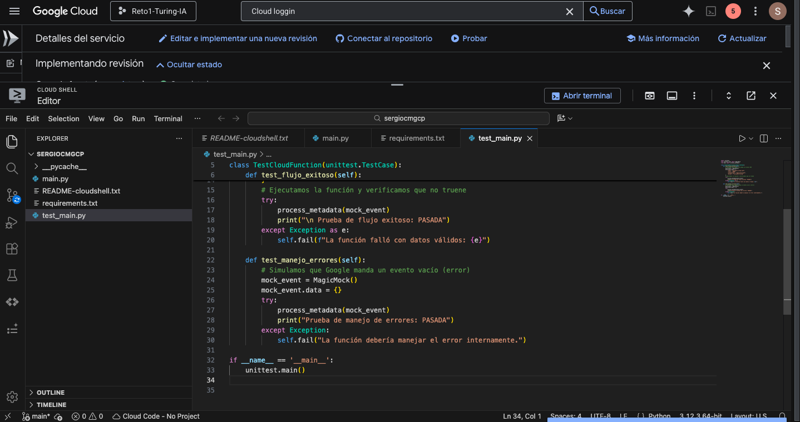
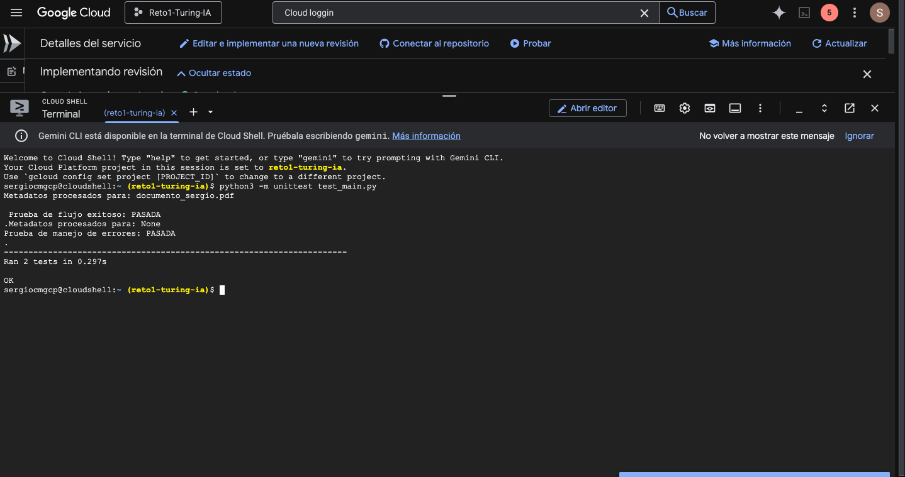
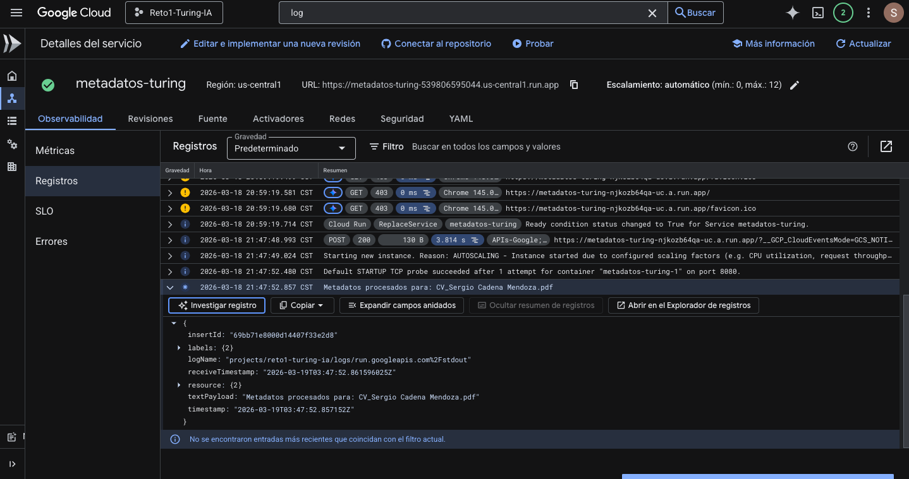

# Reto1-Turing-IA
Reto 1 de GCP para Turing-IA

En este reto tuvo como objetivo la creación de un proyecto en GCP

Parte 1.
Lo primero que se realizo fue la investigación de cada una de las APIs que se iban a usar, asi como de los permisos y roles para IAM
Activé los servicios de Cloud Functions, Cloud Build y Eventarc. Aprendí que sin estas APIs, los servicios están aislados y no pueden funcionar.
La creación y habilitación de las APIs fue relativamente sencillo.

Pero la creación del usuario de prueba con los privilegios y roles ya empezo a tener su dificultad.
Se asigno a la cuenta el rol de Escritor de registros y Receptor de eventos de Eventarc

Parte 2.
Para el almacenamiento y automatización primero se creo el bucket con la eliminación automática de archivos después de 7 días con almacenamiento estandar y acceso uniforme.
Tambien aplique politicas de acceso a un usuario de prueba para lectura y escritura.

El desarrollo del Cloud Function fue lo que mas tiempo me llevo ya que tuve algunos errores al momento de configurar, lo que causaba que el servicio no se ejecutara.
Se configuro el evento de tipo google.cloud.storage.object.v1.finalized y se vinculo al bucket, se configuro para correr con python 3.12 para la extracción de los datos y se uso un bloque de try-except para la captura de los errores en Logging.

Parte 3.
Posteriormente para las pruebas se realizo un test para saber si el analisis funcionaba bien.

Al igual que en el log se pudo visualizar la extracción de los metadatos.

